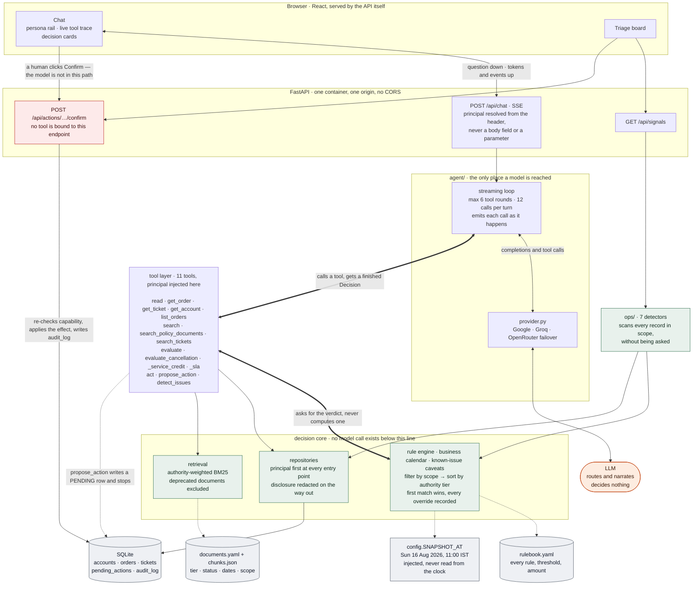

# Architecture note

## The load-bearing decision

**The model never decides anything.**

Not "the model is instructed not to decide" — it structurally cannot. Every
outcome, amount, deadline and eligibility verdict is computed by a deterministic
rule engine and handed to the model already finished. The model's job is to pick
a tool and write a sentence about what came back.

Everything else in this document follows from that. It is also what makes the
uncomfortable properties of LLMs survivable here: a model that cannot compute a
number cannot compute a wrong one, and a model that cannot arbitrate between a
contract and a policy cannot average them into a plausible mistake.

The alternative — retrieve the relevant passages and let the model reason over
them — fails on this dataset specifically. Three sources say three different
things about ORD-1001's cancellation fee, and the correct answer requires
knowing that a signed agreement outranks an SOP, which outranks a past ticket.
That is a precedence rule, not a reading-comprehension problem.

---

## The system in one picture

Three things in that picture are the whole design, and each is enforced by
something other than good intentions.

**The model hangs off the side of the spine, and reaches down exactly one
level.** It can call tools. It cannot reach the rule engine, the calendar, the
repositories or the rulebook, because nothing below the tool layer is exposed to
it. The two thick edges are drawn both ways deliberately: a call goes down and a
`Decision` comes back already finished — outcome, amount, citations, overrides,
caveats — and the model's remaining job is to write a sentence about it.

**The principal enters at the API and travels down, never up.** It is resolved
from the request header and injected server-side, so a tool argument naming
someone else's account is intersected with the session's scope rather than
believed. Every repository entry point takes it first, and a test walks the
repository layer asserting there is no code path that reaches data without one.

**The only lines into `confirm` come from the browser.** `propose_action` writes
a `PENDING` row and stops; the endpoint that executes has no tool bound to it,
so there is no sequence of model outputs that reaches execution. Capability is
re-checked at confirm rather than trusted from proposal time, because an
approval requirement enforced only at proposal is not an approval requirement.

Two paths on that diagram never touch the model at all, and both are deliberate.
The detectors on the right run from a plain GET: they scan every record in scope
and rank what they find without anyone asking, which is the proactive half of
the product. And the interface renders citations, overrides and proposed actions
out of the `Decision` events rather than out of the model's prose, so a citation
the model forgets to mention still appears on screen.

---

## Agent design

### The loop

Hand-written rather than an SDK tool runner, for one reason: the interface has
to show each tool call **as it happens**. `evaluate_cancellation(ORD-1001)` must
render while the model is still working on the next step, not after the turn
completes. An SDK runner that returns a finished turn cannot do that.

Each round:

1. Stream a completion. Text deltas go to the client immediately.
2. If tool calls came back, execute them **in order**, emitting a `tool_call`
   event before each and a `tool_result` after.
3. Append results to the conversation and loop, up to 6 rounds.

The loop also emits events the model never sends. Citations, proposed actions
and escalations are read out of the `Decision` objects the tools returned — so
the interface renders them from data the engine produced, not from whatever the
model chose to say about them. If the model omits a citation from its prose, the
citation still appears.

### The provider boundary

Nothing outside `agent/provider.py` imports an LLM client. This is not
portability theatre — it is testable in one line: 206 of the 216 tests never
noticed when the provider changed from OpenRouter to Google mid-project.

The boundary is *possible* because of the load-bearing decision above. Every
correctness-bearing component — rule engine, calendar, retrieval, access
control — contains no model call at all. Most systems cannot swap providers
cheaply because model calls are threaded through their business logic. Here
there is no such threading to unpick.

Three providers are configured (Google, Groq, OpenRouter). All speak the OpenAI
chat-completions shape, so one adapter reaches any of them. Keeping more than
one turns the central claim into something checkable rather than asserted: run
the same question through two vendors and the rupee amounts come out
byte-identical, because neither model produced them.

**Failover crosses vendors, deliberately.** The obvious design walks one
provider's model list, and it is close to useless — free quota is metered per
project, so when Google returns `RESOURCE_EXHAUSTED` every Gemini model is
exhausted at the same instant, and falling back from one to another fails for
precisely the reason the first one did. A second vendor has independent quota.
Providers without a key configured are skipped rather than attempted.

One subtlety: failover only applies *before* the first chunk is yielded. Once
the client has seen output, retrying elsewhere would splice half of one answer
onto half of another, which is worse than surfacing the error.

### Model selection was measured, not assumed

`scripts/bakeoff.py` runs each candidate through real questions and scores
tool-chain completion — not eloquence, because the engine already owns
correctness and the model only has to route.

It applies a hard gate first: **a model that will not emit a tool call cannot
drive this agent at any quality.** That gate earned its place. `gemini-2.5-flash`
is the obvious default choice, returns HTTP 200, and writes a fluent, plausible
answer — while calling the tool **0 times out of 4**. Shipped as primary, it
would have narrated from thin air with no engine underneath, which is the exact
failure this architecture exists to prevent.

The measurement also inverted two of my own guesses:

- `gemini-3.5-flash` looked like the better model by version number. It
  completed the chain **1/4** against flash-lite's **5/5**.
- Groq is **two to four times faster** to a tool call than anything on Google —
  and served **1 run in 6**, because its free tier caps tokens-per-minute at
  8,000 and one of our requests costs ~6,300. A latency probe alone would have
  promoted it. The bake-off caught it.

---

## Tool design

Eleven tools in three groups.

**Read tools** — `get_order`, `get_ticket`, `get_account`, `list_orders`,
`search_tickets`, `search_policy_documents`. Every one takes a `Principal` as
its first positional argument and returns only rows in scope.

**Decision tools** — `evaluate_cancellation`, `evaluate_service_credit`,
`evaluate_sla`. These return a finished `Decision`. The model never receives the
ingredients from which a different number could be derived, and never picks
between conflicting sources. If it could do either, the design would be wrong.

**Action and detection** — `propose_action`, `detect_issues`.

### Tool descriptions carry real design weight

They are read at the moment of routing, which makes them more effective than
system-prompt guidance for routing behaviour.

A concrete case: asked *"a pickup is three hours late, should I get a credit?"*,
the model would call the tool, then go looking for a real order, find ORD-2002
(genuinely 4h30m late), and answer about **that** instead — producing an answer
that was true of something and wrong about the question. Worse, one run said
"while you mentioned three hours, our records show the delay has now reached the
threshold", overriding the user's stated facts with a different record.

System-prompt guidance did not fix it on a small model. Putting the instruction
in the tool description did:

> *If the user states the delay themselves, pass their stated figures. Do not
> look up one of their orders and answer about its delay instead.*

This is the residual risk of the architecture, stated plainly: **the engine
guarantees the decision is correct for the facts it was given; the model still
chooses which facts to ask about.** Mitigated at the routing layer, not
eliminated.

### The model cannot execute anything

`propose_action` writes a `PENDING` row and stops. Execution happens at
`POST /api/actions/{id}/confirm` — an endpoint with **no tool bound to it**, so
there is no path by which the model reaches execution even if it tries.

The button is not a UI convenience; it is the only door. Capability is
re-checked at confirm time, so a credit above the SOP's ₹1,000 threshold stays
`NEEDS_APPROVAL` until a manager acts, and the audit row records who proposed
and who approved.

---

## Documents and structured data

Two ingestion paths, because they answer different questions.

**Structured data** (accounts, orders, tickets) is parsed from the workbook into
SQLite. Rows are facts. They are never retrieved by similarity — an order's
status is looked up, not searched for.

**Documents** (policies, agreements, product guides) are chunked by section, and
each chunk carries an **authority tier**:

| Tier | Source | Weight |
|---|---|---|
| 1 | Signed customer agreements | Binding, account-scoped |
| 2 | Current policy and SOPs | Binding, general |
| 3 | Product documentation | Informational |
| 4 | Historical ticket resolutions | **Context only, never authority** |

Tier 4 is the interesting one. Two past resolutions in this dataset assert
answers the current documents contradict. They are not suppressed — the system
must be able to *show* a wrong past answer without appearing to endorse it, so
the interface renders tier 4 with a visibly different badge and the `Decision`
carries an explicit `contradicts[]` list naming the ticket and why it was wrong.

Suppressing them would be worse. A human reading the same ticket history would
repeat the mistake.

**A deprecated policy is excluded from default search.** It reads as current and
would otherwise be retrieved confidently. Only principals holding
`read:deprecated` can reach it.

### Retrieval: BM25, not embeddings

24 chunks. Deterministic lexical scoring beats a vector index here on every axis
that matters: no model call, no index to rebuild, reproducible results, and the
queries are keyword-shaped ("cancellation fee", "bulk upload limit") rather than
semantic. An embedding model would have added a dependency, a build step, and
non-determinism to a corpus small enough to fit in a single prompt.

Retrieval is scoped before it is ranked, not after — a customer cannot reach
another account's agreement even by matching its text exactly.

---

## Source reliability and conflict handling

This is the core of the system.

### Rules live in versioned YAML, not in Python

`app/knowledge/rulebook.yaml` holds every rule, threshold and amount, each with
the document, section and verbatim quote it came from. Nothing is hard-coded in
a function body. A policy change is a data change, and the citation cannot drift
from the rule because they are the same record.

### Precedence is explicit

Rules carry a tier and an optional `replaces`. Resolution is deterministic:

1. Filter to rules whose conditions match the facts.
2. Filter to rules in scope for this account.
3. Higher tier wins.
4. A rule with `replaces` removes the rules it names, even when they would match.

The distinction between **outranked** and **replaced** is first-class, because
they mean different things to a reader:

- *outranked* — "this rule matched your facts, but lost on authority"
- *replaced* — "your agreement removed this rule entirely"

Both are disclosed. A `Decision` carries the rules that **lost**, and the
interface renders them. This is deliberate and slightly counter-intuitive: a
system that silently drops the SOP is indistinguishable, from the outside, from
one that never retrieved it. Showing the losing rule is how a reader can tell
the difference between correct reasoning and a lucky guess.

### Unknowns block only when they matter

A required fact being unknown does not automatically make an answer
unavailable. SOP v4 §3 forbids *promising a credit* under uncertainty —
declining one is the conservative direction, not the risky one.

So an unknown blocks only when it could change the answer, tested by resolving
with every unknown set in the claimant's favour: if even the best case grants
nothing, the real values cannot grant anything either.

This was not theoretical. A LumenWorks pickup three hours late fails their
four-hour threshold *whatever* the fault flags turn out to be — but an unstated
`customer_fault` was forcing `indeterminate`, and the system refused to answer
the brief's own headline question. A missing *duration* is never immaterial:
there is no bound to assume.

### Disclosure is separate from access

Access control decides which records a principal can reach. Disclosure decides
how much of a reachable answer they see — a narrower question, and one this
dataset forces.

KI-211 is a genuine caveat a customer needs ("your parcel may already have been
collected") carrying an internal tracker ID they should not see. `Caveat` ships
both registers, so it would be easy to send both and let the interface pick.

**That would be the same mistake as enforcing access control in the prompt.** It
puts the secret in the response body and the enforcement in the client. The
redaction happens at the tool boundary instead, before the payload is built —
verified on the wire: the internal stream contains `KI-211` four times, the
customer's contains it zero times, and the outcome, amount and overrides are
byte-identical.

---

## Major trade-offs

**Rules in YAML, not a general policy DSL.** A DSL would express rules this pack
does not contain. The YAML covers what exists, is readable by a non-programmer,
and every rule is traceable to a quote. If ParcelPilot's real rulebook is
hundreds of rules with temporal versioning, this becomes a database and a
different design.

**BM25, not embeddings.** Right at 24 chunks; wrong at 24,000. The retrieval
interface is narrow enough that swapping it is contained.

**SQLite, not Postgres.** The dataset is a fixed snapshot with no writes except
the audit and action tables. Postgres would add operational weight for nothing.

**Free-tier models.** A hosted demo constraint, not an architectural one. The
provider boundary makes upgrading a config line. The cost is real: free tiers
rate-limit, and the interface has to say so honestly rather than look broken.

**A pinned snapshot rather than a live clock.** Every timing answer is derived
from one injected instant, so results are reproducible in 2030. The cost is that
the system cannot answer "what is late *right now*" — which is correct for a
demo over a fixed dataset and wrong for production. A test enforces it by
grepping for `datetime.now(` outside `config.py`.

**Six tool rounds, twelve tool calls per turn.** Enough for the deepest real
chain with headroom; low enough that a confused loop cannot spend the day's
quota by itself.

**Recent turns only, no summarisation.** At this scale, compaction would buy
nothing and add a failure mode. A follow-up like "can I cancel it?" after "what
is the status of ORD-1001?" works, which is what makes it feel like a product.

---

## The client and the model get different payloads

The same `Decision` serves two consumers with different needs, and sending the
richer version to both was costing real headroom: the tool result fed back to
the model carried every verbatim citation quote, which is 39% of the payload and
which the interface never reads — it renders citations from separate events.

Trimming the model's copy cut it by 30%. But the first attempt cut too far.
Dropping *every* quote made the answers measurably vaguer — "cancel any shipment
still in BOOKED status before pickup" became "cancel shipments under these
circumstances", because the specific condition lived in the quote. A vaguer cited
answer is a bad trade for tokens.

The rule that works: keep the quote for the **highest-authority citation
present** and drop the rest. That is the rule that decided the outcome and the
one the answer must state precisely; lower tiers are shown by the interface for
transparency, and the model only needs to name them.

## What I would change next

**Cross-encoder re-ranking** if the corpus grows past a few hundred chunks.
BM25's failure mode is a query whose keywords do not appear in the right passage.

**Rule coverage tests generated from the rulebook**, so adding a rule without a
matching test fails CI.

**A shared rate-limit store** if this is ever scaled past one instance. The
current limiter is in-process, which is correct for a single container and
silently becomes per-instance otherwise.
